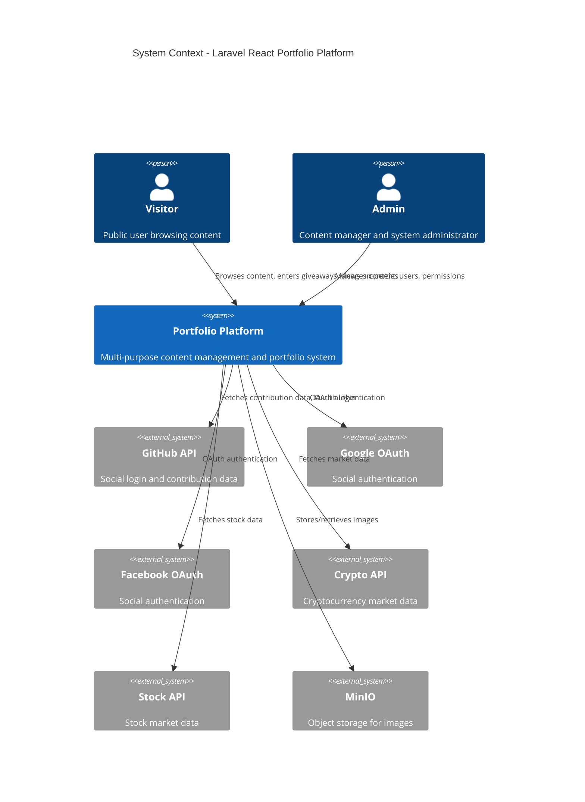
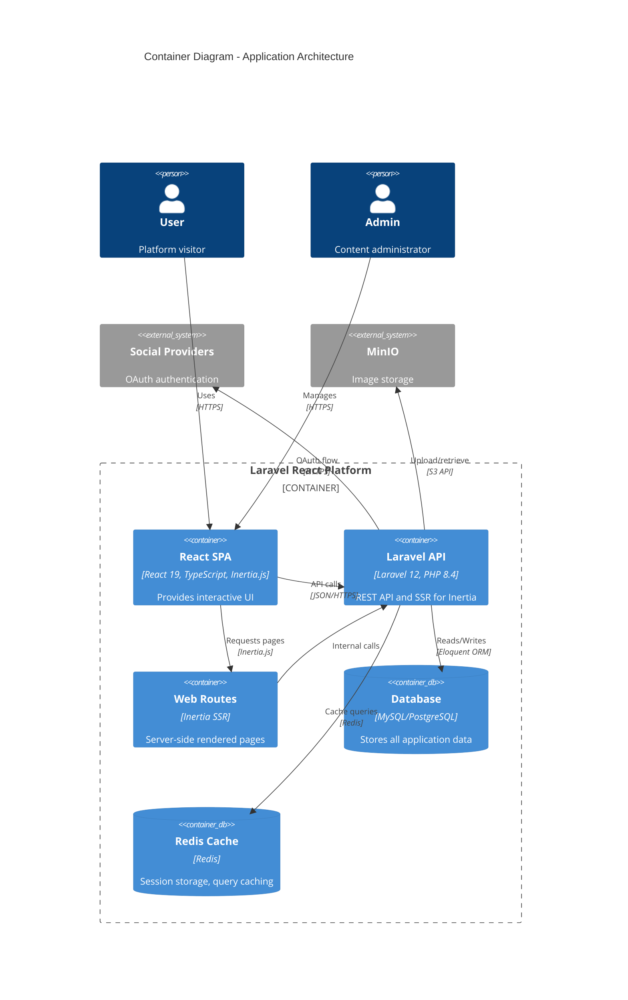
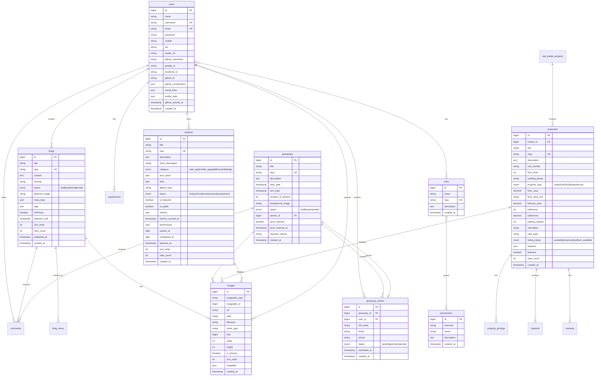
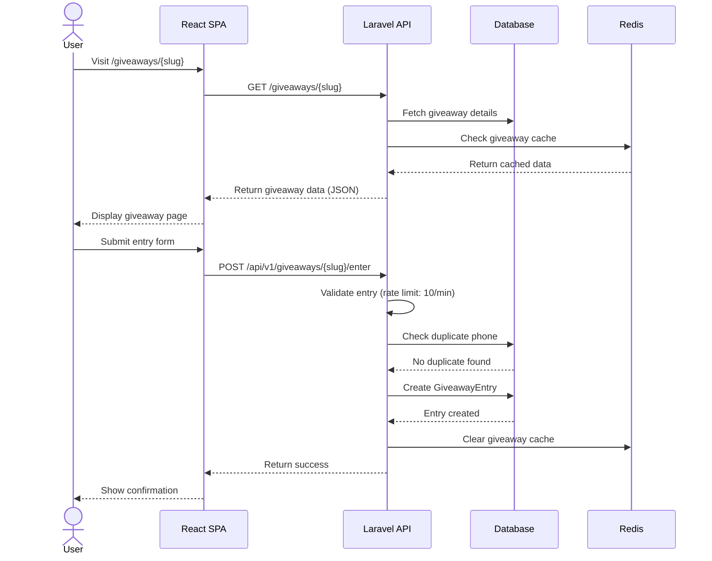
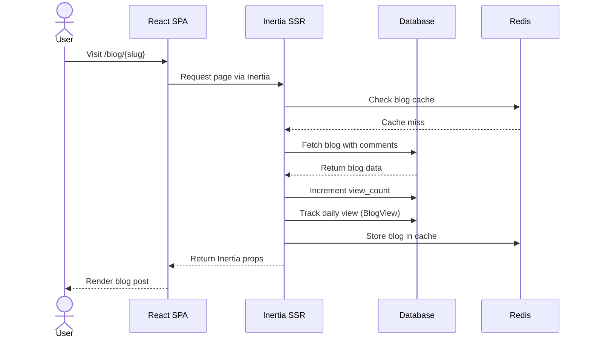
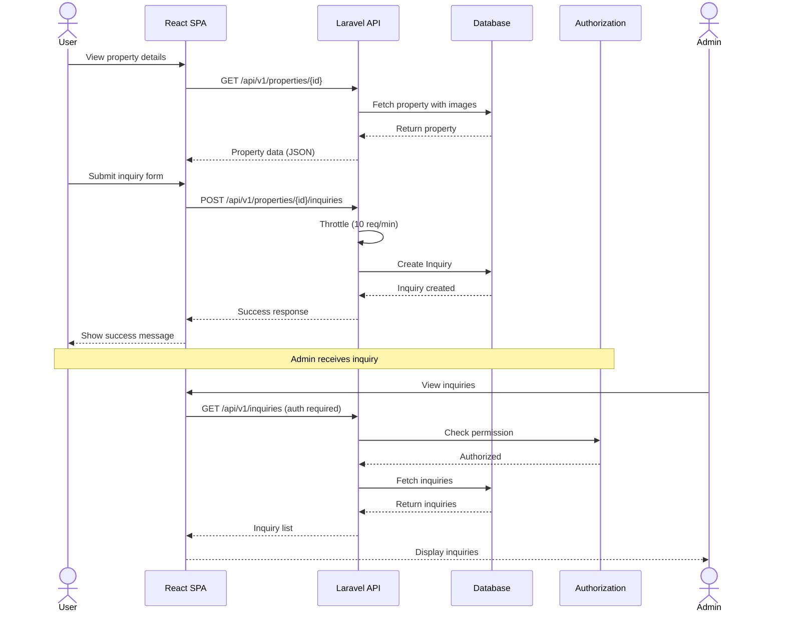
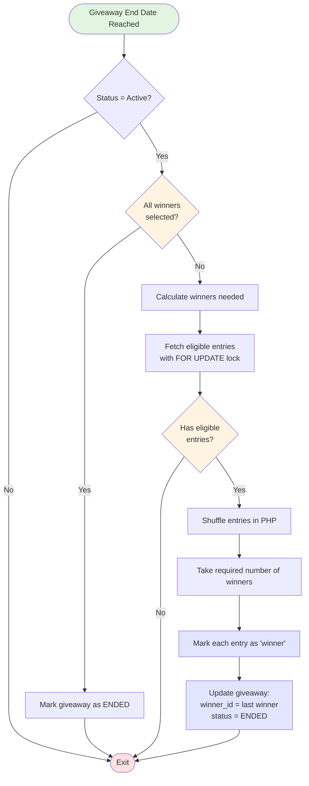
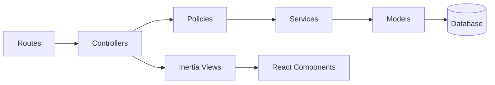

# Architecture Documentation

> **Auto-generated**: 2026-01-12
> **Stack**: Laravel 12 + React 19 + Inertia.js v2 + TypeScript + Tailwind CSS v4

---

## Table of Contents

1. [System Overview](#system-overview)
2. [Technology Stack](#technology-stack)
3. [System Context Diagram](#system-context-diagram)
4. [Container Architecture](#container-architecture)
5. [Entity Relationship Diagram](#entity-relationship-diagram)
6. [Application Structure](#application-structure)
7. [Key Features](#key-features)
8. [Data Flow Examples](#data-flow-examples)
9. [Deployment Architecture](#deployment-architecture)
10. [Security & Performance](#security--performance)

---

## System Overview

This is a **multi-purpose portfolio and content management system** built with Laravel 12 and React 19. The application combines:

- **Portfolio Website**: Personal profile, projects showcase, experiences, expertises
- **Blog Platform**: Rich-text blog posts with comments, views tracking, featured system
- **Giveaway Management**: Complete giveaway system with entry tracking, winner selection
- **Real Estate Platform**: Property listings with inquiry management
- **Financial Tracking**: Crypto and stock market data integration
- **User Management**: Authentication, roles, permissions, social login (GitHub, Google, Facebook)

---

## Technology Stack

### Backend
- **Framework**: Laravel 12 (PHP 8.4.16)
- **Authentication**: JWT (tymon/jwt-auth) + Laravel Socialite v5
- **Database**: MySQL/PostgreSQL with Eloquent ORM
- **Cache**: Redis
- **Image Processing**: Intervention Image
- **Testing**: Pest v3, PHPUnit v11
- **Code Quality**: Laravel Pint v1

### Frontend
- **Framework**: React 19 with TypeScript
- **Routing**: Inertia.js v2 (SSR-ready)
- **Styling**: Tailwind CSS v4
- **UI Components**: Radix UI, shadcn/ui
- **Rich Text Editor**: TipTap (for blog content)
- **Animations**: Framer Motion
- **Charts**: Recharts
- **Build Tool**: Vite 6

### DevOps
- **Containerization**: Docker + Docker Compose
- **Development**: Laravel Sail v1
- **CI/CD**: GitHub Actions
- **Deployment**: Production & Development configurations

---

## System Context Diagram



---

## Container Architecture



---

## Entity Relationship Diagram



---

## Application Structure

### Directory Layout

```
laravel-react-12/
├── app/
│   ├── Http/
│   │   ├── Controllers/
│   │   │   ├── Admin/              # Admin panel controllers
│   │   │   ├── Api/                # REST API controllers
│   │   │   ├── Auth/               # Authentication controllers
│   │   │   └── Settings/           # User settings controllers
│   │   └── Middleware/             # Custom middleware
│   ├── Models/                     # Eloquent models (26 models)
│   ├── Policies/                   # Authorization policies
│   └── Services/                   # Business logic services
├── database/
│   ├── factories/                  # Model factories for testing
│   ├── migrations/                 # Database migrations
│   └── seeders/                    # Database seeders
├── resources/
│   ├── js/
│   │   ├── Pages/                  # Inertia.js page components (65+ pages)
│   │   │   ├── admin/              # Admin pages
│   │   │   ├── auth/               # Authentication pages
│   │   │   ├── blog/               # Blog pages
│   │   │   ├── giveaway/           # Giveaway pages
│   │   │   ├── profile/            # User profile pages
│   │   │   ├── project/            # Projects showcase
│   │   │   └── user/               # Public user pages
│   │   ├── Components/             # Reusable React components
│   │   ├── Layouts/                # Page layouts
│   │   └── app.tsx                 # App entry point
│   └── css/
│       └── app.css                 # Tailwind CSS
├── routes/
│   ├── web.php                     # Main web routes
│   ├── api.php                     # API routes (v1)
│   ├── admin.php                   # Admin panel routes
│   ├── auth.php                    # Authentication routes
│   ├── settings.php                # User settings routes
│   └── user.php                    # User-specific routes
├── tests/
│   ├── Feature/                    # Feature tests (Pest)
│   └── Unit/                       # Unit tests (Pest)
└── docker-compose.yml              # Docker configuration
```

### Route Structure

**6 Route Files**:
1. **web.php** - Main application routes (home, blog, properties, giveaways, projects)
2. **api.php** - REST API v1 (properties, giveaways, expertises, inquiries)
3. **admin.php** - Admin panel routes (content management)
4. **auth.php** - Authentication routes (login, register, social auth)
5. **settings.php** - User settings routes (profile, password)
6. **user.php** - User-specific routes

---

## Key Features

### 1. **Portfolio Management**
- Personal profile with bio, headline, about sections
- Projects showcase with live/archived/development status
- GitHub integration for contribution tracking
- Technology stack and skills display
- Experiences timeline

### 2. **Blog Platform**
- Rich-text editor (TipTap) for content creation
- Multi-tier featured system (manual + auto-trending)
- View tracking with daily analytics
- Comment system with moderation
- Tags and metadata
- Sitemap generation for SEO

### 3. **Giveaway System**
- Draft → Active → Ended workflow
- Multiple winners support
- Phone verification
- Winner selection algorithm (random with rejection handling)
- Entry tracking and validation
- Prize claim tracking

### 4. **Real Estate Platform**
- Property listings with comprehensive details
- Real estate project grouping
- Property pricing models
- Inquiry management system
- Advanced filtering (type, bedrooms, floor, area, price)
- Featured properties

### 5. **User Management**
- Role-based access control (RBAC)
- Custom permissions system with resource-action mapping
- Social login (GitHub, Google, Facebook)
- JWT API authentication
- Profile management with avatar uploads

### 6. **Financial Tracking**
- Cryptocurrency market data integration
- Stock market data tracking
- Portfolio monitoring

### 7. **Comment System**
- Polymorphic comments (works on blogs and giveaways)
- Comment moderation (pending, approved, rejected)
- Comment reporting
- Nested comments support

### 8. **Image Management**
- Polymorphic image relationships
- MinIO integration for object storage
- Primary image designation
- Image ordering
- Multiple images per entity
- Automatic thumbnail generation

---

## Data Flow Examples

### Example 1: Giveaway Entry Flow



### Example 2: Blog View Tracking Flow



### Example 3: Property Inquiry Flow



### Example 4: Winner Selection Algorithm



---

## Deployment Architecture

### Development Environment

```yaml
# docker-compose.yml
services:
  - laravel.test (PHP 8.4, Laravel 12)
  - mysql (Database)
  - redis (Cache & Sessions)
  - minio (Object Storage)
  - mailpit (Email Testing)
  - selenium (Browser Testing)
```

**Access**:
- App: `http://localhost`
- MinIO Console: `http://localhost:8900`
- Mailpit: `http://localhost:8025`

### Production Environment

```yaml
# docker-compose.prod.yml
services:
  - app (Optimized Laravel)
  - mysql (Production DB)
  - redis (Cache & Queue)
  - minio (Production Storage)
  - nginx (Reverse Proxy)
```

**Environment Variables**:
- `.env` - Development config
- `.env.production` - Production config

---

## Security & Performance

### Security Features

1. **Authentication & Authorization**
   - JWT tokens for API authentication
   - Session-based auth for web
   - RBAC with granular permissions
   - Policy-based authorization
   - Social OAuth integration

2. **Input Validation**
   - Form Request classes for all inputs
   - CSRF protection
   - Rate limiting on sensitive endpoints
   - SQL injection prevention (Eloquent ORM)
   - XSS protection (React auto-escaping)

3. **Data Protection**
   - Password hashing (bcrypt)
   - Soft deletes for data recovery
   - Image upload validation
   - Environment variable protection

### Performance Optimizations

1. **Caching Strategy**
   - Homepage caching (30 min for experiences/expertises)
   - Projects caching (10 min)
   - User permissions caching (5 min)
   - Blog view caching
   - Redis for query results

2. **Database Optimization**
   - Eager loading to prevent N+1 queries
   - Database indexes on foreign keys and slugs
   - Soft deletes for data integrity
   - Query scopes for reusability

3. **Frontend Optimization**
   - Code splitting with Vite
   - Lazy loading for images
   - Inertia.js for SPA-like experience without full SPA overhead
   - Tailwind CSS purging for minimal CSS bundle

4. **Rate Limiting**
   - Comment creation: 10 requests/minute
   - Comment reporting: 5 requests/minute
   - Giveaway entries: 10 requests/minute
   - Property inquiries: 10 requests/minute
   - API reads: 60 requests/minute
   - API writes: 30 requests/minute

---

## Component Architecture

### Laravel MVC Flow



### Key Models (26 total)

**Core Models**:
- User, Role, Permission
- Blog, BlogView
- Project, Experience, Expertise
- Giveaway, GiveawayEntry

**Real Estate**:
- RealEstateProject, Property, PropertyPricing, Contact, Inquiry

**Supporting Models**:
- Image (polymorphic)
- Comment (polymorphic)
- Technology, Skills, About

### React Component Structure

```
Components/
├── ui/                    # shadcn/ui primitives (Button, Input, etc.)
├── layouts/               # Page layouts
├── blog/                  # Blog-specific components
├── giveaway/              # Giveaway-specific components
├── property/              # Property listing components
├── project/               # Project showcase components
└── shared/                # Shared utility components
```

---

## API Versioning

### REST API v1

**Base URL**: `/api/v1`

**Endpoints**:
- **Auth**: `/auth/login`, `/auth/register`, `/auth/me`
- **Properties**: `/properties`, `/properties/{id}`, `/properties/search`
- **Giveaways**: `/giveaways`, `/giveaways/{slug}/enter`
- **Expertises**: `/expertises`, `/expertises/categories`
- **Inquiries**: `/inquiries`, `/inquiries/statistics`

**Authentication**: JWT Bearer tokens

**Rate Limits**:
- Public reads: 60 req/min
- Authenticated writes: 30 req/min
- Submissions: 10 req/min

---

## Testing Strategy

### Test Coverage

- **Feature Tests**: User flows, API endpoints, authentication
- **Unit Tests**: Model methods, business logic, helpers
- **Testing Framework**: Pest v3 with Pest Laravel plugin

**Running Tests**:
```bash
php artisan test                           # All tests
php artisan test --filter=BlogTest         # Specific test file
php artisan test --filter=testCanCreate   # Specific test name
```

---

## Development Guidelines

### Code Standards
- Laravel Pint for code formatting
- PHPDoc blocks for complex methods
- Type hints for all method parameters and returns
- Follow Laravel conventions

### Git Workflow
- `master` - Production branch
- `develop` - Development branch
- Feature branches off `develop`

### Environment Setup

**Development**:
```bash
composer install
npm install
cp .env.example .env
php artisan key:generate
php artisan migrate --seed
npm run dev
```

**Production Build**:
```bash
npm run build
php artisan optimize
php artisan config:cache
php artisan route:cache
```

---

## Future Enhancements

Based on the codebase structure, potential areas for expansion:

1. **Newsletter System** - Email subscriptions for blog updates
2. **Advanced Analytics** - Detailed user behavior tracking
3. **Notification System** - Real-time notifications for comments, giveaway winners
4. **Multi-language Support** - i18n for blog content
5. **Advanced Search** - Full-text search with Meilisearch/Algolia
6. **GraphQL API** - Alternative API layer for mobile apps
7. **WebSockets** - Real-time updates for giveaway entries
8. **File Exports** - PDF generation for property listings

---

## Conclusion

This Laravel 12 + React 19 application represents a **modern, full-stack monolithic architecture** with:

- ✅ **Clean separation of concerns** (MVC + React components)
- ✅ **Comprehensive authorization** (Roles, Permissions, Policies)
- ✅ **Performance optimizations** (Redis caching, eager loading)
- ✅ **API-first design** (REST API v1 with versioning)
- ✅ **Modern frontend** (React 19, TypeScript, Tailwind v4)
- ✅ **Docker-ready deployment** (Development + Production configs)
- ✅ **Test coverage** (Pest v3 feature and unit tests)

The architecture supports **multiple business domains** (portfolio, blog, giveaways, real estate) within a single codebase while maintaining code quality and scalability.
